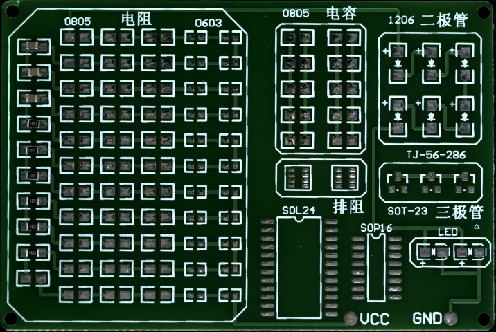
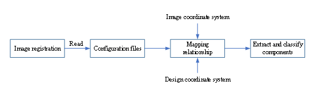
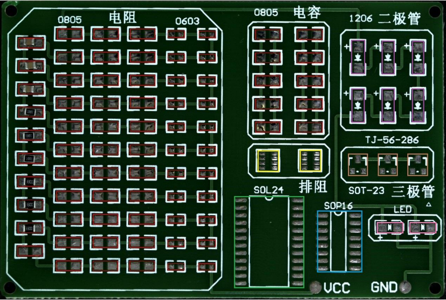

# PCB-electric-resistance-Dataset  
A Dataset on PCB component electric resistance 0805  
本博客以0805型封装的电阻为例，介绍PCB板上0805型电阻数据集的制作过程。总体来看，制作数据集的方法主要可以分为以下四步：  
（1）获取高水平图像；  
（2）实现图像配准；  
（3）快速获取检测区域；  
（4）快速生成训练神经网络所需的大量样本；  
  
  首先第一步（1）如何获取高水平图像：  
  方法：使用滤波器抑制图像噪声；  
  
  其次第二步（2）如何实现图像分割与配准：    
  实现图像分割的方法：1）基于Canny算法的边缘检测：通过求取图像的边缘可以完成前景与背景的分割。2）基于阈值的图像分割：在炉前AOI检测系统中，常用此方法来分离背景图像与前景图像。  
  
  实现图像配准的方法：求取待矫正图像与理想图像的刚性变换矩阵。下图展示了配准后的图像：  
  
    
  
  然后是第三步（3）如何快速获取检测区域：  
  样本目标提取的方法：通过标定图像尺寸与PCB设计文件，生成PCB板上元器件从设计文件到矫正后图像的映射关系。PCB图像中检测域提取流程如下图所示：  
  
    
  
  下图展示了PCB图像中检测域的提取效果。其中，红色框为提取的0805封装和0603封装的电阻和电容区域；黄色框为提取的排阻区域；绿色框为提取的SOL24芯片区域；蓝色框为提取的SOP16芯片区域；紫色框为提取的二极管区域；棕色框提取的为三极管区域；粉色框为提取的LED灯区域。  
  
    
  
  实现数据增强的方法：
  本数据集主要是针对样本旋转角度和横向/纵向偏移值做了数据增强。数据增强主要包括前景提取、样本增强、图像融合三个步骤。前景提取主要指将目标图像与背景图像进行分割，提取出不含有背景的目标图像；样本增强主要指通过旋转和偏移等操作增强样本的分布。图像融合主要指将增强后的前景图像与背景图像进行融合。下图展示了数据增强的整体框架。
  
  
  
  
  
  
  
